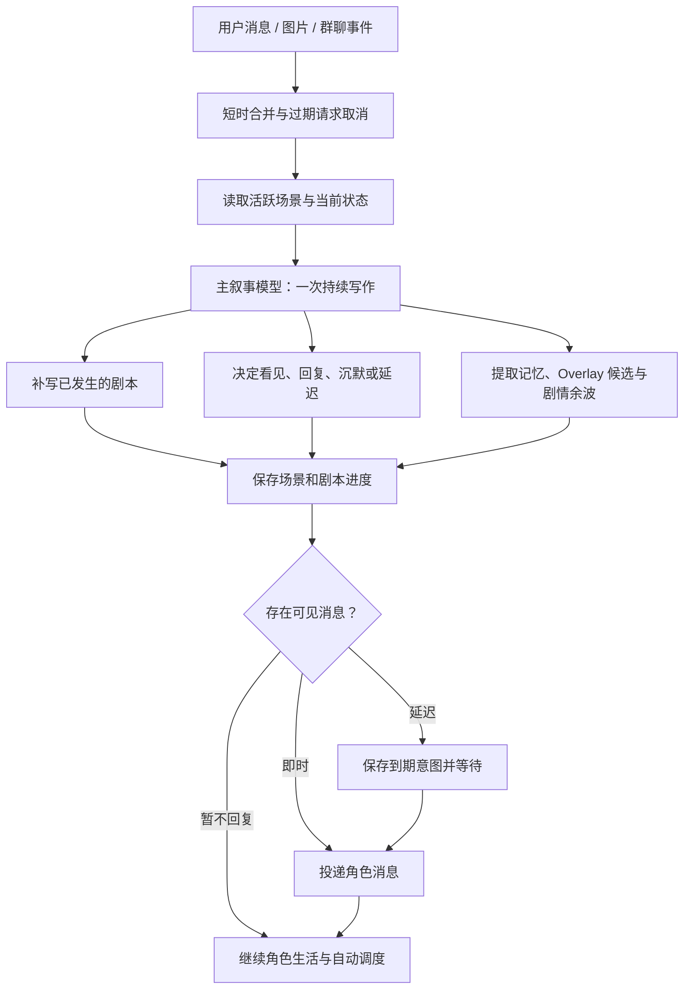

# HDS Interlude / 幕间系统

> 聊天在幕前发生，生活在幕间继续。

HDS Interlude 是一个 Koishi 一对一 / 多参与者拟真聊天框架。它将角色的聊天视为持续生活剧本中的可见部分：用户消息、角色的沉默、延迟回复、主动联系和自动推进，都由同一次叙事写作共同决定。

当前源码版本：`0.1.2-beta7`

## 它解决什么问题

普通聊天机器人通常把每条消息当作独立问答。HDSI 维护的是以主角为中心的持续剧情状态：角色有日程、关系、待办、情绪、配角和未完成事件；用户消息是进入该现实的一项事件，而不是必须立即得到回答的命令。

这套框架的目标不是让角色永远在线，而是让她在已有生活中自然决定：是否看到消息、是否愿意回复、何时回复、回复什么，以及这件事会给后续生活留下什么影响。

## 核心结构

### 一个主剧本，多位参与者

一个机器人账号维护一个 Canonical Story（主剧本）。多个已授权用户可以进入同一主剧本，但每位参与者保留独立的资料、初始关系、关系演化和近期互动状态。

这使角色能在不同账号之间安排注意力、兑现约定或自然地表示自己正被其他事情占用，而不会把每个账号拆成彼此隔绝的人格副本。

### 活跃场景是短期连续性的来源

每次主叙事写作都会读取当前活跃场景中最近发生的真实条目：用户 / 群聊事件、已成功投递的角色消息、剧本段落与必要的场景摘要。它保留原始对话的语义、说话顺序和时间信息，同时通过字符预算控制上下文规模。

当前用户事件只会在本轮以“当前事件”身份出现一次；自动推进没有用户事件时，也不会伪造“用户刚发来消息”。这样可避免把旧消息重新当作实时消息，或把未投递的角色台词写成既成事实。

### 不同时间间隔采用不同写作尺度

HDSI 不会用同一套节奏处理几十秒和数小时：

- **即时回合**：适合高密度对话，重点接住上一句、保持正在发生的场景。
- **短间隔回合**：补充手头事务、微小情绪与对话余波。
- **中间隔回合**：允许日程、配角互动和未完成事项继续发展。
- **长间隔 / 自动推进**：补写角色已经经历的生活，并在有现实动机时产生延迟回复、提醒或主动联系。

时间尺度由真实时间差决定；剧情只能补写已经过去的时间，不能把未来当作已经发生。

## 一次消息如何变成剧情



```text
用户发送消息 / 图片
        ↓
2 秒短时合并（连续消息合成同一轮）
        ↓
读取活跃场景、当前状态、关系、记忆、待办与剧情引子
        ↓
主叙事模型一次写作：补写已发生时间 + 处理当前事件 + 决定可见行为
        ↓
保存剧本、场景进度、记忆候选、关系变化与未来意图
        ↓
按即时 / 延迟 / 不回复投递角色消息
```

新消息会使尚未完成的旧合并请求失效，并取消对应的未投递延迟计划。因此，短时间连续发送多条消息时，角色会把它们作为一个完整语境处理，而不是对前一句单独回复后再补救。

## 主叙事模型的职责

主模型是核心写作者，不需要再串联“补写故事”“判断是否回复”“写回复”多个独立请求。每次调用会同时生成：

1. 当前时间段内已经发生的剧本；
2. 对当前用户事件、到期意图或自动推进的处理；
3. 是否已看见、回复模式、消息内容及计划发送时间；
4. 长期事实、状态变化、Overlay 候选、剧情余波和未来意图。

结构化输出中的互动决策形如：

```json
{
  "seen": true,
  "reason": "她刚放下正在收拾的东西，想确认对方的状态。",
  "reply": {
    "mode": "immediate",
    "content": "怎么了"
  }
}
```

`reason` 仅记录本轮已经发生的、与决策有关的现实原因，便于日志和后续连续性。它不是另一次模型调用，也不要求角色每轮都回复。

模型输出可使用 `<sep/>` 拆分消息。插件会按下一段文字长度模拟短暂输入时间；用户在等待期间继续发言时，旧分段计划会被取消并重新写作。

## 自动推进与剧情余波

对话结束后，系统可以按配置在约 10 分钟、20 分钟进行短期后续补写，之后按常规间隔继续生活推进；休息时间段可改用更长间隔。

自动推进没有实时用户消息，但仍会读取：

- 尚未结束的场景和近期已投递对话；
- 已安排的提醒、延迟回复、约定与未完成事项；
- 由对话留下的“剧情余波”；
- 角色自身正在进行的生活、配角和世界状态。

因此，用户说过的重要话、请求的提醒或对角色有影响的事件，不会在下一次普通自动推进前被简单丢弃。主模型也可以在角色有具体动机时发起主动联系；每次候选动作会携带 `willingness`（意愿值）和原因，插件仅投递达到阈值、目标合法且数量受限的动作，不采用固定冷却或随机强制发言。

## 记忆与设定演化

HDSI 将信息按用途分层，而不是把完整历史剧本永久塞进每次请求。

| 层级 | 用途 |
| --- | --- |
| Canon | 初始角色、世界、配角与参与者关系，是剧情起点。 |
| 活跃场景 | 当前连续剧情的原始条目与摘要，是短期连贯性的主要依据。 |
| 剧情引子 / 近期事实 | 正在处理的事、最近生活细节、关系余波和下一步线索。 |
| 长期事实 | 承诺、重要事件、稳定世界事实和未解决事项。 |
| Overlay | 角色性格、世界状态、关系等在长期剧情中渐进形成的非破坏性变化。 |
| 意图 | 延迟回复、提醒、主动联系或后续处理计划。 |

较早的场景和 Overlay 会在后台分档压缩：保留因果、承诺、大事件与关系变化，减少重复性叙述。压缩是异步整理，不会在用户每次发言时额外增加一次主叙事调用。

### 修改设定时的建议

小幅修改 Canon（例如补充兴趣、修正措辞）通常不需要清理数据。若修改会明显改变角色身份、核心性格、世界规则或某位参与者的初始关系，建议在 Console 修改后按需清除对应 Overlay：

```text
interlude.overlay.clear character
interlude.overlay.clear relationship
interlude.overlay.clear world
```

指令会在聊天中要求 `y/n` 确认。只清理对应演化层，不会删除全部剧本和记忆。详见 [管理员指令集](command.md)。

## OneBot / NapCat 与群聊

OneBot 模式采用显式白名单：启用后，只有绑定的机器人 QQ 账号和用户 QQ 白名单中的账号能够进入 HDSI。空白名单表示不授权任何私聊用户，避免机器人对所有私聊自动回复。

每位白名单用户可单独填写：

- 用户背景 / 角色眼中的身份；
- 初始关系；
- 是否参与共享主剧本；
- 需要时的独立备注。

群聊与私聊分开配置。群聊需要单独列入群白名单并填写群用途、主角在群中的身份和发言模式；可选“群聊判断模型”先读取有限上下文，判断消息是否值得进入主叙事，减少水群造成的无意义调用。

## 图片与网页观察

### 原生视觉

开启 `vision.enabled` 后，使用 OpenAI-compatible 多模态主模型时，图片会作为 `image_url` 内容块和当前用户文本一起发送给模型。支持 OneBot CQ 图片码、URL、`file`、`cache_url` 与机器人 `get_image` 路径，兼容电脑端 JPG 和常见手机端图片来源。

动态 GIF、动态 WebP 与 APNG 可在 Puppeteer 可用时抽取代表帧后发送；不能安全读取时会跳过该图片。图片二进制不会写入剧本、记忆或数据库，且只有真正成功加载的图片才会告知模型，避免“看见不存在图片”的幻觉。

### 网页观察

可选 Puppeteer 服务允许角色在剧情确有需要时请求有限的网页观察。插件会限制协议、页面数量、内容长度和超时，再把提取到的公开页面文本作为本轮写作参考。它不是无边界浏览器代理，也不会自动执行账号登录或敏感操作。

## 安装

### 从 npm 安装

发布到 npm 后，可在 Koishi 项目根目录执行：

```bash
npm install koishi-plugin-hds-interlude@beta
```

稳定版发布后可省略 `@beta`。然后在 Koishi Console 添加 `hds-interlude` 插件并完成配置。

### 本地 tgz 安装

如果使用测试包，可在 Koishi 实例目录执行：

```bash
npm install /absolute/path/to/koishi-plugin-hds-interlude-0.1.2-beta7.tgz
```

Windows 示例：

```powershell
npm install C:\dev\HDS-Interlude\plugins\hds-interlude\release\koishi-plugin-hds-interlude-0.1.2-beta7.tgz
```

安装后重新加载 Koishi，再在 Console 启用插件。

### 开发实例

仓库根目录包含开发用 Koishi 实例。安装依赖后：

```bash
cd C:\dev\HDS-Interlude
npm install
npm run dev
```

OneBot / NapCat 未启动时可能出现 `ECONNREFUSED`，这表示适配器无法连接本地反向 WebSocket，不代表 HDSI 编译或加载失败。

## Console 配置顺序

建议按以下顺序配置，能减少“模型正常但没有互动”之类的排查成本：

1. **基础设定**：主角、世界、配角、叙事风格、默认关系。
2. **模型中心**：先添加服务提供商，再添加可复用模型预设；主叙事、压缩、Embedding、群聊判断分别选择模型预设，并设置温度、top-p、超时和故障切换。
3. **平台控制**：启用 OneBot 后填写机器人 QQ、私聊用户白名单；如需群聊，再添加群白名单。
4. **剧情节奏**：连续消息合并、自动推进、休息时段、延迟消息和主动联系意愿阈值。
5. **记忆与上下文**：活跃场景预算、场景保留、压缩阈值、长期事实、Embedding 与 Overlay 整理策略。
6. **可选能力**：视觉、Puppeteer、网页观察、日志级别和日志内容开关。

所有字段的解释、默认值和调整建议见 [配置说明](CONFIGURATION_GUIDE.md)。首次测试可直接跟随 [新手引导](BEGINNER_GUIDE.md)。

## 常用管理员指令

以下指令默认使用 `interlude` 主命令；危险操作会在当前会话中要求 `y/n` 确认。

| 指令 | 作用 |
| --- | --- |
| `interlude.status` | 查看当前故事、调度、模型与运行状态。 |
| `interlude.context` | 查看本轮主模型会读取的上下文摘要。 |
| `interlude.timeline [limit]` | 查看近期时间线。 |
| `interlude.script [limit]` | 查看近期剧本条目。 |
| `interlude.advance` | 手动推进一次剧本。 |
| `interlude.memory [limit]` | 查看记忆摘要。 |
| `interlude.memory.add <scope> <content>` | 手动写入长期事实。 |
| `interlude.memory.intents [limit]` | 查看延迟回复、提醒等待处理意图。 |
| `interlude.overlay.status` | 查看 Overlay 与候选状态。 |
| `interlude.overlay.compact` | 手动整理 Overlay。 |
| `interlude.overlay.clear <character\|relationship\|world\|all>` | 清除指定 Overlay 层。 |
| `interlude.purge.range <from> <to>` | 删除指定时间段的剧本与相关数据。 |
| `interlude.purge.platform <platform>` | 删除指定平台的数据，例如 `sandbox` 或 `onebot`。 |
| `interlude.purge.all` | 删除全部 HDSI 剧本和记忆。 |

范围删除使用 ISO-8601 时间，例如：

```text
interlude.purge.range 2026-08-18T13:00:00+08:00 2026-08-19T02:00:00+08:00
```

完整参数、确认流程与恢复建议见 [command.md](command.md)。

## 日志与排查

插件日志提供摘要、标准和诊断三个详细程度。标准 / 诊断日志可显示：模型调用开始与结束、场景时间段、自动推进计时器、到期意图、消息投递、记忆整理、图片读取及 SQLite 重试摘要。

建议排查顺序：

1. 使用 `interlude.status` 确认故事、白名单和调度是否处于活动状态。
2. 使用 `interlude.context` 核对当前事件、活跃场景与参与者身份是否正确。
3. 查看模型调用日志，确认调用的提供商、模型预设和结构化输出是否成功。
4. 发生 SQLite `disk I/O error` 时，先确认 Koishi 数据库文件未被同步软件、备份软件、杀毒扫描或第二个 Koishi 进程占用；插件会对短暂失败进行串行化和退避重试，但无法修复外部文件锁或磁盘问题。

## 使用边界

- HDSI 依赖模型的写作与结构化输出能力。较小或不稳定的模型更容易出现格式失败、过度重复或关系跳跃。
- 自动推进是基于已记录状态的补写，不是现实世界感知；它不应被用作医疗、紧急救助、法律或其他高风险场景的替代服务。
- 主动联系需要显式开启，并始终受白名单、参与者资料、意愿阈值与单轮数量限制。
- 清空数据库、删除范围剧本和清除 Overlay 均可能不可逆；执行前请先导出 Koishi 数据库。

## 文档导航

- [新手引导](BEGINNER_GUIDE.md)：首次安装、推荐配置与测试路径。
- [配置说明](CONFIGURATION_GUIDE.md)：全部 Console 字段、模型和调度参数。
- [管理员指令集](command.md)：剧本、记忆、意图、Overlay 与清理指令。

## 开发与验证

```bash
cd C:\dev\HDS-Interlude
npm run build
npm test
```

构建产物位于 `plugins/hds-interlude/lib`。发布前建议运行构建、测试和 `npm pack --dry-run`，确认包内仅包含 `lib` 与需要分发的文档。
